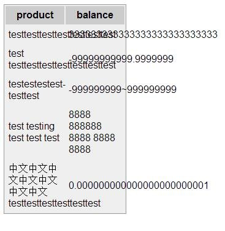
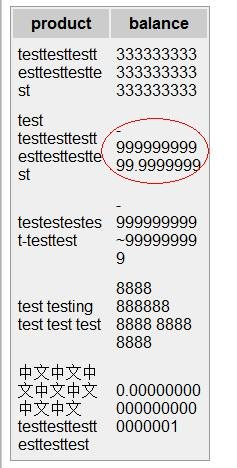
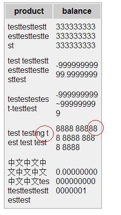

最近修改页面排版的一些问题，发现关于内容分词换行有两个主要的CSS：

## word-wrap 和 word-break

特别是word-wrap还有个取值break-word，更使得这两个属性容易混淆。

先来看看这两个属性的定义和取值吧：

word-warp：用来表明是否允许**长单词**内断句而移至下一行。

| normal         | 只在允许断句点进行断句。比如单词连接符“-”。  |
| -------------- | ------------------------ |
| **break-word** | 内容将在边界内换行。如果需要，单词内部允许断句。 |

word-break：指定行内断句规则。

| normal    | 依照不同文本的规则决定是否在单词内断句。                     |
| --------- | ---------------------------------------- |
| break-all | 允许单词内断句。                                 |
| keep-all  | 不允许在成对单词间断句，主要是针对亚洲文本，对于中文，韩文，日文，不允许字断开。 |

PS. 上面两个CSS实际上对中文影响不大，主要是针对英文。

 

让我们看看默认情况下浏览器的行为，大致上都一样（代码见文末）：

测试浏览器版本：Firefox 24.0 , Chrome 30.0 , IE10, IE8



从上面可以看出，其实换行是一种默认行为，如果容器宽度不足，会在允许换行的点进行换行（比如空格，单词连接符等等）。因此，**word-wrap**其实是专门为长单词准备的。

接下来，看看加上 word-wrap: break-word 之后，除了**IE8**以外，其他行为基本一致：


而至于低版本的IE，好吧，悲剧的数字符号：



 

## word-wrap: break-word的问题

1. 在长单词的上一行可能会留下大量空白，但是由于一般单词长度并不会出现那么多字符，因此这个缺点其实可以接受；

2. 低版本的IE对于带符号的数字不作为一个整体来断句。

再来看看word-break:break-all的用法，首先要注意一点，它必须与word-wrap: break-word一起使用才能起作用。包括旧版本的IE，几个浏览器的行为都基本一致了：



可以看出，**break-all的行为简单粗暴，就是完全不考虑单词连贯性，直接将其断句。**这样虽然看上去节省了空间，但是却损失了可读性。**因此，除非页面中出现连续无意义的长字符，否则不建议用起进行单词换行处理。**

另一方面，可以看到，break-all可以解决低版本IE带符号数字的问题，因此可以考虑将其单独用在数字上。（适合不是有多个数字在同一容器）

## HTML代码

```HTML
<table>
    <tr>
        <th>product</th>
        <th>balance</th>
    </tr>
    <tr>
        <td>testtesttesttesttesttesttest</td>
        <td class="numeric">333333333333333333333333333</td>
    </tr>
    <tr>
        <td>test testtesttesttesttesttesttest</td>
        <td class="numeric">-99999999999.9999999</td>
    </tr>
    <tr>
        <td>testestestest-testtest</td>
        <td class="numeric">-999999999~999999999</td>
    </tr>
    <tr>
        <td>test testing test test test</td>
        <td class="numeric">8888 888888 8888 8888 8888</td>
    </tr>
    <tr>
        <td>中文中文中文中文中文中文中文testtesttesttesttesttest</td>
        <td class="numeric">0.000000000000000000000001</td>
    </tr>
</table>        
```

## CSS代码

```CSS
body {
    color: #000000;
    background-color: #ffffff;
    font-family: arial, verdana, sans-serif;
}

table {
    background-color: #efefef;
    border-style: solid;
    border-width: 1px;
    border-color: #999999;
    table-layout: fixed;
    width: 200px;
}

th {
    background-color: #cccccc;
    font-weight: bold;
    padding: 5px;
}

td {
    padding: 5px;
    width: 100px;
    word-wrap: break-word;
}

td.numeric {
    word-break:break-all;
}
```