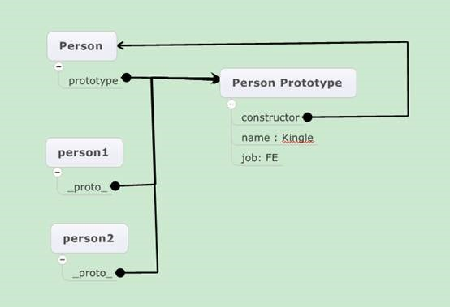
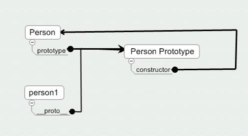
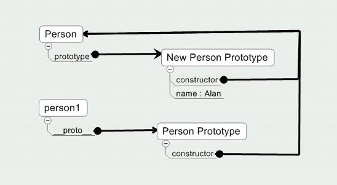

## 原型链的关系

在Javascript中，只要创建了一个新函数，就会为该函数创建prototype属性，指向函数的原型对象，**Object.prototype是所有对象最顶层的原型**。所有对象都继承由Object构造函数创建的原型对象，也就是说，所有的原型对象都继承Object.prototype的属性，而这个原型对象默认有一个constructor属性指向Object构造方法的原型。

**默认所有原型对象都会有constructor属性，这个属性包含一个指向prototype属性所在函数的指针。通过构造函数创建实例后，每个实例内部都有一个指针指向函数的prototype对象**。Firefox，safari，Chrome中这个指针是__proto__，可以通过脚本访问。但是在IE中这个属性是不可见的，所以无法在IE中修改__proto__。同时，这个属性的关联关系是在实例与构造函数的prototope对象之间，而不是实例跟构造函数之间。

<!--more-->

事实上，虽然IE无法访问内部的__proto__ 属性，但是通过以下方法可以确定在IE中有这样的隐式关系：

```javascript
Person.prototype.isPrototypeOf(person1)
```

如果内部有一个指向Person.prototype 的指针，那么就会返回true。

具体看以下例子：

```javascript
function Person(){

}

Person.prototype.name = “Kingle”;

Person.prototype.job = “FE”；

var person1 = new Person();

var person2 = new Person();
```


具体关系看下图：（所有图示均省略了与Person构造函数的关系）



从上图 可以看出： Person.prototype.constructor 指向 Person。可以说，由prototype、constructor、__proto__三个指针构成了整个javascript的原型链。另外要注意一点，__proto__这个属性存在于实例中，而prototype只存在函数对象中，实例中不存在prototype对象。

## 关于prototype属性

由于函数本身也是一个对象，因此它拥有来自构造函数的原型，即javascript的Function object。**但是，函数本身的****prototype****属性仅仅用于函数实例的属性继承，而函数本身不会使用这个关联的prototype****。（在prototype****中设置的属性将直接作用于所有实例）**

如下代码，我们使用Person.prototype来为所有Person实例设置属性，而不是用person1.prototype来为person1设置实例。


```
function Person(){}

Person.prototype.name = “Thom”;

var person1 = new Person(){};

person1.name; // Thom

Person.name; // undefined
```

 

## 关于constructor属性

那么constructor属性呢？可以尝试以下代码：

```javascript
console.log(person1.constructor); //function Person(){ }

console.log(person1.constructor == Person.constructor); //false

console.log(person1.constructor == Person.prototype.constructor); //true
```

 

可以看出，原型的属性是共享的，因此，**constructor属性也是共享的，可以通过实例访问。**

但是，另一方面，**无法通过实例修改原型中的值**。如果在实例中添加了一个属性，并且属性名跟原型中的相同，那么将会在实例中创建该属性并屏蔽原型中的那个属性。（如果对应属性的值不是引用对象）。

## 普通变量的原型

如果是普通变量的情况，**变量其实是对应构造函数的实例，因此存在__proto__属性**，并指向对应构造函数的原型：


```
var num1 = 1;

console.log(num1.prototype);//undefined

console.log(num1.__proto__);//Number{}

var str = "1";

console.log(str.prototype);//undefined

console.log(str.__proto__);//String{}

var obj = {};

console.log(obj.prototype);//undefined

console.log(obj.__proto__);//Object{}
```

 

## 原型链属性的读取

由于**读取对象属性时，先搜索实例本身，如果找到对应属性则停止搜索，如果没有找到，再搜索原型对象**。因此，在实例中添加原型同名属性，不会影响到其他实例。如下代码：

```javascript
function Person(){}

Person.prototype.name = "Alan";

var person1 = new Person();

var person2 = new Person();

person1.name = "Nolen";

alert(person1.name); //Nolen

alert(person2.name); //Alan
```

 

如果想删除实例中的属性，使其重新访问原型对象中的属性，可以用**delete操作符**：

```javascript
function Person(){}

Person.prototype.name = "Alan";

var person1 = new Person();

var person2 = new Person();

person1.name = "Nolen";

alert(person1.name); //Nolen

alert(person2.name); //Alan

delete person1.name;

alert(person1.name);//Alan
```

## in 操作符及 hasOwnProperty()方法

javascript中检测对象属性有两种方式，一种是使用in操作符，一种是hasOwnProperty()方法。这两种方式的区别是：in操作符会同时检测原型和实例，而hasOwnProperty方法只会检测实例。看下面的例子：

```javascript
function Person(){}

Person.prototype.name = "Alan";

var person1 = new Person();

alert(person1.hasOwnProperty("name"));//false

alert("name" in person1);//true

person1.name = "Nolen";

alert(person1.hasOwnProperty("name"));//true

alert("name" in person1);//true
```

 

因此，在使用for-in循环的时候，如果只想访问实例中的属性，就要配套使用hasOwnProperty方法，如：

```javascript
for(var prop in person1){

    if(person1.hasOwnProperty(prop)){

        alert(prop);

    }

}        
```

## 原型的重写

由于为原型一个个单独添加属性和方法不利于封装，因此更好的做法是用封装好的属性和方法的字面量来重写整个原型对象。如下：

```
function Person(){}

    Person.prototype = {

        constructor : Person,

        name : "Alan",

        age : 1，

        sayName ： function(){

    }

};    
```

注意constructor 的属性，**如果不在新的原型对象中重新设定，那么constructor属性将不在指向Person**。因为这里完全重写了默认的prototype对象，因此constructor属性将指向新的contructor—object构造函数。因此将无法通过constructor确定对象类型。

另一方面，由于原型和实例之间通过指针关联起来，因此对原型做的修改可以从实例上表现出来，如下：

```javascript
function Person(){}

Person.prototype.name = "Alan";

var person1 = new Person();

Person.prototype.age = 1;

alert(person1.name); //Alan

alert(person1.age); //1
```

但是，如果使用重写原型的方法，就相当于切断了构造函数与最初原型的联系。一个实例只拥有一个唯一的原型，而实例中的指针又只指向原型，而不是构造函数。因此，**原型的重写最好在实例之前，否则实例将指向最初的原型**。如下例子：

```javascript
function Person(){}

var person1 = new Person();

Person.prototype = {

    constructor : Person,

    name : "Alan",

    age : 1

};

alert(person1.name); //undifined

alert(person1.constructor.prototype.name);//Alan
```


通过图示可以更直观的理解。下图为重写原型之前的原型链：



下图为重写原型后的原型链：



可以看出，修改原型后，原来的实例__proto__属性所指向的原型还是原来的原型，因此无法找到新原型的属性。

 

## 一些有趣的原型链

Object是本身的实例，因为在Object的原型链中存在着constructor属性指向Object：

```javascript
console.log(Object.__proto__.__proto__.constructor === Object);//true

console.log(Object instanceof Object);//true

function Person(){}

console.log(Person instanceof Person);//false
```

Function的constructor指向本身，也就是说，Function.__proto__ 指向 Function.prototype:

```javascript
console.log(Function.constructor === Function);//true

console.log(Function.__proto__ === Function.prototype); //true
```