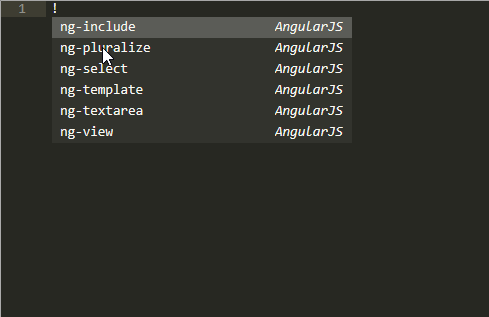
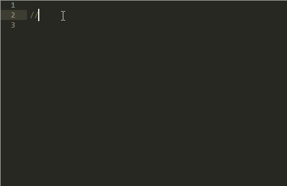

## Emmet

可以说是必备了，可以快速编写HTML代码。

## HTML-CSS-JS Prettify

代码格式化插件。

JsFormat只能格式化js 代码，这个可以格式HTML, CSS 和JS代码。

## Side bar

加强版的侧边栏。

## DocBlockr

非常方便的注释添加工具。

## ConvertToUTF8

防止乱码。

## 联想型插件：

All Autocomplete -- 可以自动从以打开的文件中联想。

AutoFileName -- 可以联想文件路径。

## Sublime Linter

跟jsHint结合，可以在编写代码是显示错误信息。

## Auto Semi-colon

即使你的光标不在行尾，也可以在冒号的结尾加上分号。

## PlainTasks

纯文本的任务列表插件。