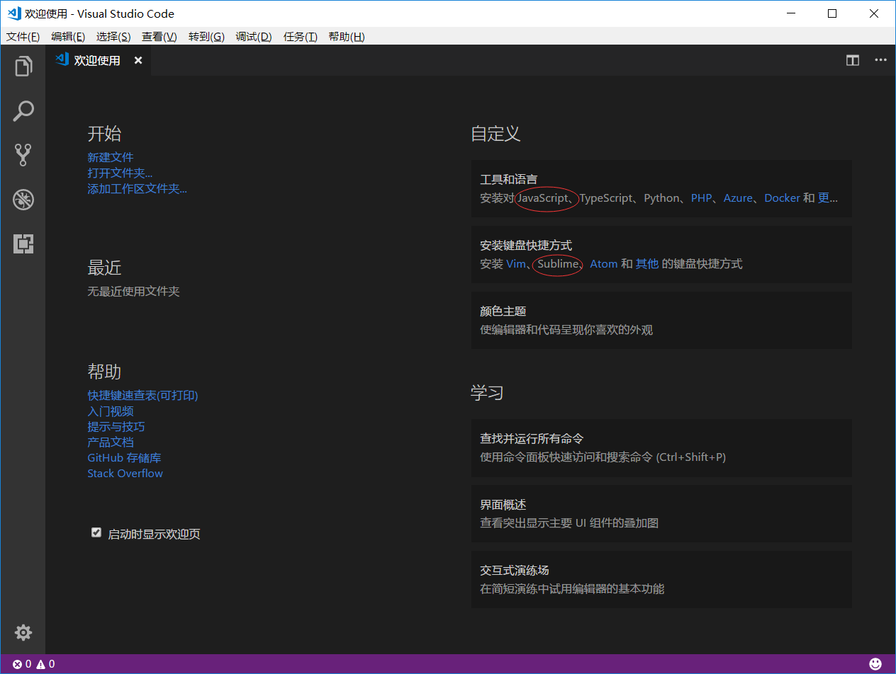
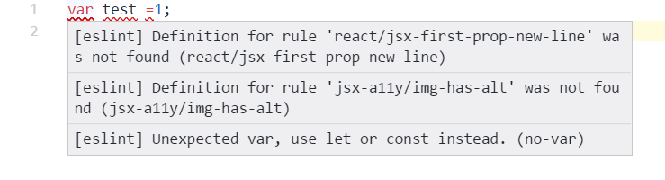

使用了一段时间的VSCode之后，发现确实方便，而且可以无缝从SublimeText切换过来。在代码静态检测这块，同样是使用eslint，VSCode明显比SublimeText更加方便和明了。

### 安装VSCode
从[官网下载](https://code.visualstudio.com/Download)VSCode,安装完成后可以设置为SublimeText快捷方式。


### 在项目中配置eslint
VSCode自带eslint插件，因此无需再安装，直接在项目中进行配置即可。
eslint规则方面，目前使用airbnb规则集，再针对一些做调正。
配置完成后，如果代码不满足静态规则，会提示错误，并且无法打包。

> 也可以在代码中使用注释的方式在特殊情况下屏蔽规则。


image
#### 安装eslint相关包
```shell
npm --save-dev install eslint
npm --save-dev install eslint-loader
```
如果安装过慢可以临时使用淘宝镜像，或者直接修改镜像地址
```shell
npm --registry https://registry.npm.taobao.org install XXXXXXX #临时使用淘宝镜像安装某一个包

npm config set registry https://registry.npm.taobao.org #直接修改npm镜像地址
```

#### 安装airbnb 
安装airbnb的时候要注意各个包的版本
```shell
#查询版本号
npm info "eslint-config-airbnb@latest" peerDependencies 
#安装对应版本
npm install --save-dev eslint-config-airbnb eslint@^#.#.# eslint-plugin-jsx-a11y@^#.#.# eslint-plugin-import@^#.#.# eslint-plugin-react@^#.#.#
```
windows可以通过install-peerdeps进行安装
```shell
npm install -g install-peerdeps
install-peerdeps --dev eslint-config-airbnb
```
如果版本安装错误，静态校验的时候可能会出现错误。
```
Definition for rule 'react/jsx-first-prop-new-line' was not found  react/jsx-first-prop-new-line
Definition for rule 'jsx-a11y/img-has-alt' was not found           jsx-a11y/img-has-alt
```

#### 配置webpack
```json
module: {
      preLoaders: [{
        test: /\.js[x]?$/,
        include: [path.join(rootPath, 'app')],
        loader: 'eslint-loader'
      }],
      loaders: [
        // ......
      ]
    }
```
#### 配置.eslintrc
```json
{
    "extends": "airbnb",
    "parser": "babel-eslint",
    "env": {
        "es6": true,
        "node": true
    },
    "strict": [2, "global"],
    "parserOptions": {
        "ecmaVersion": 2017,
        "sourceType": "module",
        "ecmaFeatures": {
            "jsx": true,
            "experimentalObjectRestSpread": true
        }
    },
    "globals": {
        "$": true,
        "window": true,
        "document": true,
        "__dirname": true
    },
    "rules": {
        "indent": ["error", 4],
        "react/jsx-indent": ["error", 4],
        "react/jsx-indent-props": ["error", 4],
        "linebreak-style": 0,
        "max-len": ["error", 200],
        "wrap-iife": ["error", "inside"],
        "no-console": 0,
        "no-new": 0,
        "no-new-func": 1,
        "func-names": 0,
        "no-underscore-dangle": 0,
        "no-useless-concat": 0,
        "no-param-reassign": [2, { "props": false }],
        "space-before-function-paren": ["error", "never"],
        "yoda": [1, "never", {
            "exceptRange": true,
            "onlyEquality": true
        }],
        "no-implicit-coercion": [
            2,
            {
                "boolean": true,
                "number": true,
                "string": true,
                "allow": [
                    /* "!!", "~", "*", "+" */
                ]
            }
        ],
    }
}
```

### 使用Prettier进行代码格式化

前端代码格式化的插件很多，使用Prettier的主要原因是它可以很方便的支持React语法，其他插件要么不支持，要么需要自定义配置。
直接在VSCode中搜索安装Prettier，加载后使用Ctrl + Shift + P即可格式化文件。
为了适应个人习惯以及ESlint代码检查（比如个人强迫症，tab必须为四个空格），可以对Prettier自定义配置。
文件 --- 首选项 --- 设置
```json
{
    "workbench.startupEditor": "newUntitledFile",
    "sublimeTextKeymap.promptV3Features": true,
    "editor.multiCursorModifier": "ctrlCmd",
    "editor.snippetSuggestions": "top",
    "editor.formatOnPaste": false,
    "workbench.colorTheme": "GitHub Plus",
    "window.zoomLevel": 0,
    "prettier.singleQuote": true,
    "prettier.trailingComma": "all",
    "prettier.arrowParens": "always",
    "prettier.tabWidth": 4,
}
```


