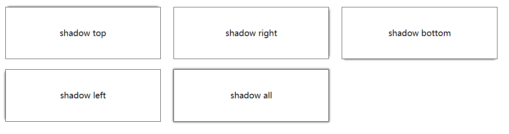

## box-shadow

<!--more-->

box-shadow可以设置六个属性：

* inset 

  边框内阴影

* offset-x  

  水平偏移量，负数为左边阴影

* offset-y  

  垂直偏移量，负数为上边阴影

* blur-radius 

  模糊半径

* spread-radius  

  取正值时，阴影扩大；取负值时，阴影收缩。默认为0，此时阴影与元素同样大。

  可以利用spread-radius 为offset-x | offset-y 相同像素的负数来抵消阴影，从而只有模糊阴影。

* color

```css
box-shadow: [inset? && [ <offset-x> <offset-y> <blur-radius>? <spread-radius>? <color>? ]
```


> 四个边框阴影
```css
.all {
	box-shadow: 0 0 5px #333;
}
```
> 上边框阴影
```css
.top {
	box-shadow: 0 -5px 5px -5px #333;
}
```
> 右边框阴影
```css
.right {
	box-shadow: 5px 0 5px -5px #333;
}
```
> 下边框阴影
```css
.bottom {
	box-shadow: 0 5px 5px -5px #333;
}
```
> 左边框阴影
```css
.left {
	box-shadow: -5px 0 5px -5px #333;
}
```


## border-radius

border-radius跟margin类似，可以只定义一个属性代表四个圆角的半径，也可以分开定义，顺序为左上角、右上角、右下角、左下角。或者

- border-top-left-radius
- border-top-right-radius
- border-bottom-right-radius
- border-bottom-left-radius


如果border-radius只定义了2到4个属性，则跟margin有区别，如果对角没有定义，则样式应用于对角，具体规则见下：

```css
border-radius: radius             
border-radius: top-left-and-bottom-right top-right-and-bottom-left 
border-radius: top-left top-right-and-bottom-left bottom-right 
border-radius: top-left top-right bottom-right bottom-left 
```


