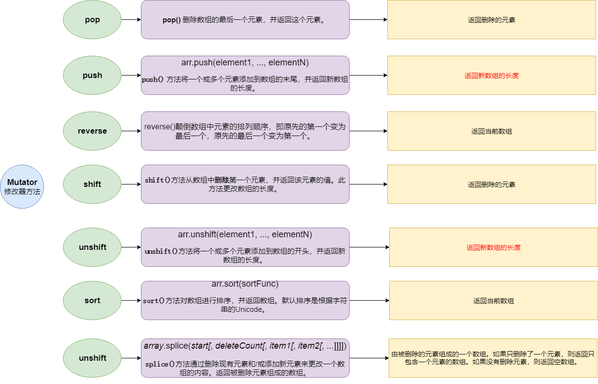
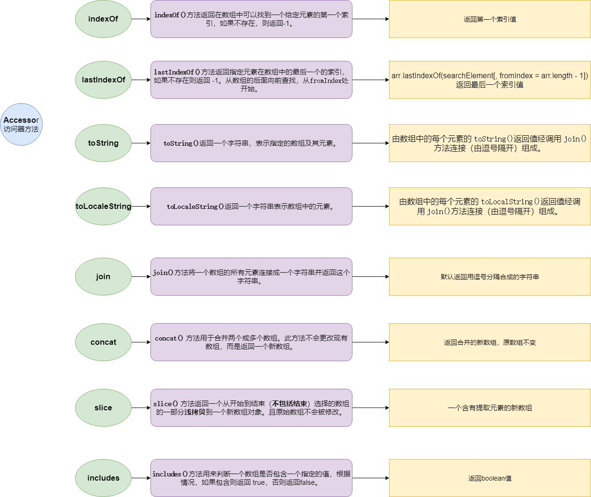
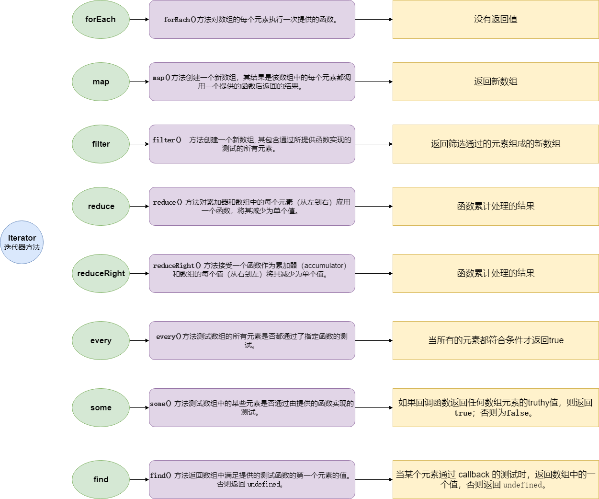

JavaScript 中对数组的操作有几十个方法，在实际的应用中，要注意方法对原数组的影响及方法的返回值。有的方法是直接在原数组上进行修改，有的则是返回一个新数组。针对数组方法，可以分成三种类型：

* 修改器方法（Mutator）： 会修改数组本身
* 访问器方法（Accessor）：不会修改数组本身
* 迭代器方法（Iterator）

<!--more-->

## 修改器方法（Mutator）

## 访问器方法（Accessor）

## 迭代器方法（Iterator）

